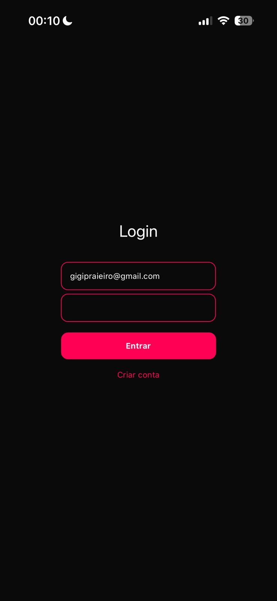
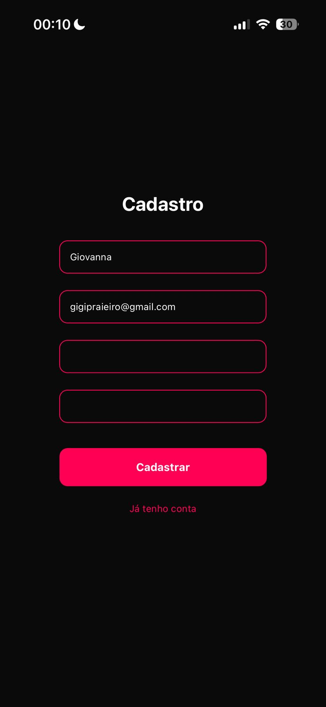
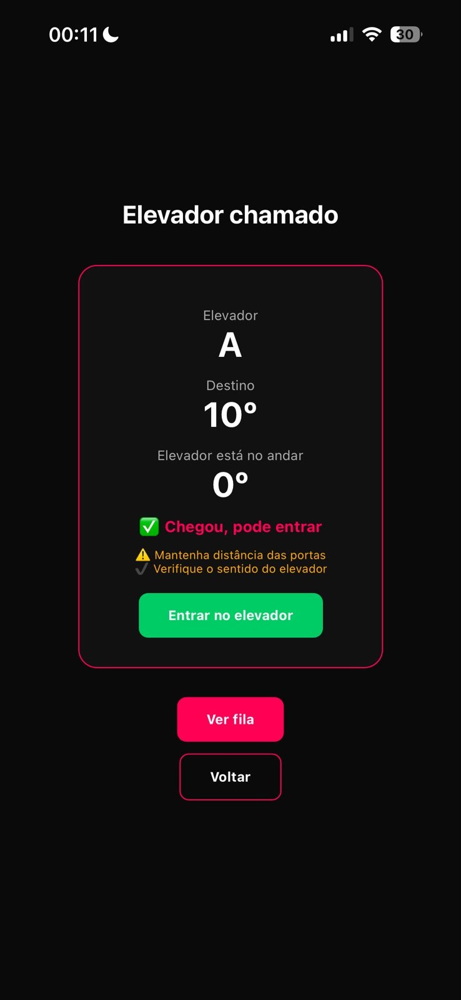

# Liftly — Sistema Inteligente de Elevadores

## Integrantes

Giovanna Praieiro Pavani — RM 565681  
Julia Aparicio de Souza — RM 563623  
Maria Eduarda de Oliveira — RM 565386  
Nicolle Calasans Rosanti — RM 564381  

---

## Sobre o Projeto

O Liftly é um aplicativo mobile desenvolvido em React Native com o objetivo de melhorar a experiência dos alunos da FIAP no uso dos elevadores.

O problema identificado envolve a alta demanda, filas desorganizadas e falta de previsibilidade no uso dos elevadores, resultando em longos tempos de espera e dificuldade de acesso.

A aplicação propõe uma solução prática, permitindo ao usuário informar o andar desejado, receber a indicação de um elevador e acompanhar o status da chamada e sua posição na fila.

---

## Evolução do Projeto (CP1 para CP2)

No primeiro checkpoint (CP1), o projeto contemplava:

- Estrutura inicial da aplicação  
- Navegação entre telas  
- Simulação básica do funcionamento dos elevadores  
- Interface inicial do sistema  

No segundo checkpoint (CP2), foram implementadas melhorias significativas:

- Sistema de autenticação com cadastro e login  
- Persistência de dados utilizando AsyncStorage  
- Gerenciamento de estado global com Context API  
- Proteção de rotas para usuários não autenticados  
- Validação de dados nos formulários  
- Suporte a múltiplos usuários  
- Implementação de tema claro e escuro (Dark Mode)  
- Melhorias na organização do código e experiência do usuário  

---

## Funcionalidades

- Cadastro de usuários com validação de dados  
- Login com verificação de credenciais  
- Armazenamento local de dados  
- Controle de sessão do usuário  
- Inserção do andar desejado  
- Indicação de elevador disponível  
- Exibição do status do elevador  
- Simulação de fila de espera  
- Simulação de deslocamento até o destino  
- Navegação entre telas com Expo Router  
- Suporte a tema claro e escuro  

---

## Diferencial Técnico

O projeto implementa suporte completo a tema escuro (Dark Mode), com controle global por meio de contexto.

- Utilização de ThemeContext para gerenciamento do tema  
- Aplicação dinâmica de cores em todas as telas  
- Consistência visual entre os diferentes estados do aplicativo  
- Melhoria na experiência do usuário e acessibilidade  

---

## Tecnologias Utilizadas

- React Native  
- Expo  
- Expo Router  
- TypeScript  
- AsyncStorage  
- Context API  

---

## Como Executar o Projeto

### Pré-requisitos

- Node.js instalado  
- Expo CLI  
- Aplicativo Expo Go (dispositivo móvel) ou navegador  

### Passos para execução

```bash
git clone https://github.com/gipraieiro/fiap-cpad-cp2-liftly.git
cd fiap-cpad-cp2-liftly
npm install
npx expo start
Após iniciar o projeto, escaneie o QR Code com o Expo Go ou utilize o navegador para visualizar a aplicação.

---

## Explicação Técnica

### Autenticação

O sistema de autenticação foi implementado utilizando Context API, por meio de um contexto global responsável por armazenar e gerenciar o estado do usuário autenticado.

### Persistência de Dados

Os dados dos usuários são armazenados localmente utilizando AsyncStorage, permitindo a persistência das informações mesmo após o encerramento do aplicativo.

### Proteção de Rotas

A navegação do aplicativo foi estruturada de forma que apenas usuários autenticados tenham acesso às telas principais, garantindo controle de acesso.

### Gerenciamento de Estado

A aplicação utiliza Context API para compartilhamento de dados globais, evitando o uso excessivo de propriedades (props) e facilitando a manutenção do código.

### Tema (Dark Mode)

O controle de tema é realizado por meio de um contexto específico, permitindo a alternância entre modo claro e escuro com aplicação consistente em toda a interface.

---

## Demonstração

### Tela Login


### Tela Cadastro


### Tela Home  


### Tela Resultado  


### Tela Fila  


---

## Considerações Finais

O projeto Liftly evoluiu significativamente entre os checkpoints, incorporando conceitos essenciais do desenvolvimento mobile, como autenticação, persistência de dados e gerenciamento de estado global.

A solução proposta demonstra a aplicação prática de tecnologia para resolução de problemas reais, contribuindo para uma experiência mais eficiente e organizada no uso dos elevadores.